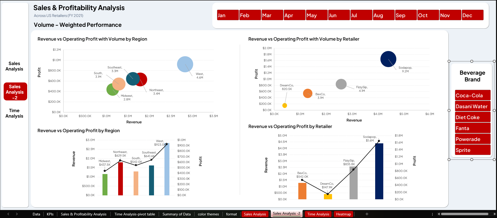

# 🥤 Coca-Cola Sales Analysis (Excel Dashboard Project)
## Excel-Based Business Intelligence Dashboard | FY 2021 | US Retailers

## 📌 Project Overview

This project analyzes Coca-Cola sales performance across major U.S. retailers using Microsoft Excel. The goal is to uncover actionable insights related to **sales trends, profitability, regional performance, and pricing strategy**.

### 🎯 Key Business Questions

- How do sales vary across regions and retailers?
- What is the relationship between price, volume, and profit?
- Which areas are driving or hurting profitability?
- How can Coca-Cola optimize sales strategy?

---

## 📊 Dataset Description

The dataset contains multi-sheet transactional data including:

- 💰 Revenue (Sales)
- 📦 Units Sold
- 📈 Operating Profit
- 💲 Price per Unit
- 🏪 Retailers: BevCo, DreamCo, FizzySip, Sodapop
- 🌍 Regions: Midwest, Northeast, South, Southeast, West
- 📅 Monthly Data: January – December

---

## 🧹 Data Preparation

The following data cleaning and transformation steps were performed:

- ✅ Cleaned column names and removed inconsistencies
- 🔄 Converted date and numeric formats
- ❌ Handled missing/null values
- 📊 Structured pivot tables for dashboard creation

---

## 📈 Dashboards Overview

### 1️⃣ Sales Analysis Dashboard

- Revenue & Profit overview
- Profit by Region and Retailer
- Scatter plots (Revenue vs Profit)
- Price vs Units Sold analysis

👉 **Key Insight:** Higher revenue does not always mean higher profit — pricing strategy plays a crucial role.

---

### 2️⃣ Sales Analysis – Volume Focus

- Bubble charts (Revenue vs Profit vs Volume)
- Retailer performance comparison

👉 **Key Insight:** Sodapop drives the highest revenue but requires margin optimization.

---

### 3️⃣ Time Analysis Dashboard

- Monthly revenue and profit trends
- Seasonal sales patterns
- Brand-wise sales performance

👉 **Key Insight:** Peak sales occur during mid-year (June–August), indicating strong seasonal demand.

---

### 4️⃣ Heatmap Dashboard

- Regional and retailer performance intensity
- Quick identification of high and low-performing segments

👉 **Key Insight:** The West region consistently outperforms other regions.

---

## 🔍 Key Findings

| Area | Finding |
|---|---|
| **Top Retailer** | Sodapop — $1.6M profit, 9.2M units sold |
| **Top Region** | West — $923K profit, highest volume |
| **Weakest Retailer** | DreamCo — $147K profit, lowest across all metrics |
| **Weakest Region** | Midwest — $437K profit, lowest margin |
| **Peak Period** | June–July across all brands and regions |
| **Price Sweet Spot** | $0.40–$0.60 per unit (volume drops sharply above $0.60) |

---

## 💡 Business Recommendations

1. **Strengthen the Sodapop partnership** — expand shelf space, co-branded promotions, and preferential trade terms.
2. **Review DreamCo urgently** — diagnose whether the issue is pricing, distribution, or the partnership itself.
3. **Front-load Q2 investment** — capitalize on the June–July summer demand spike with increased inventory and marketing spend.
4. **Build a Midwest turnaround strategy** — targeted pricing adjustments and local brand activation campaigns.
5. **Protect the $0.40–$0.60 price band** — avoid price increases bove $0.60 to prevent significant volume erosion.

---

## 🛠 Tools Used

- Microsoft Excel
- Pivot Tables
- Slicers & Interactive Filters
- Data Visualization (Charts & Heatmaps)

---

## 🎯 Conclusion

This analysis demonstrates how Coca-Cola can improve profitability by balancing **pricing strategy, regional focus, and retailer performance**, while leveraging **seasonal demand patterns**.
