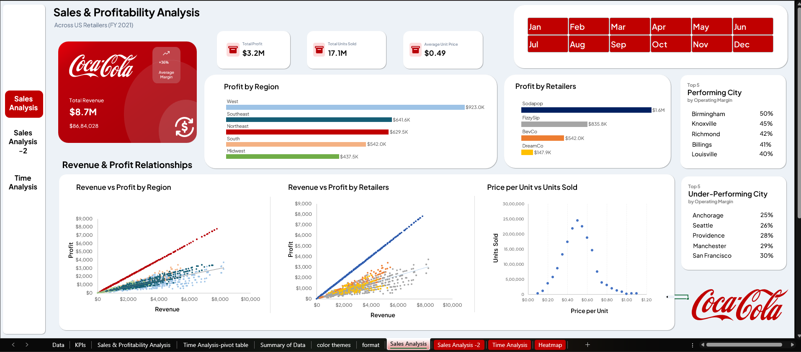
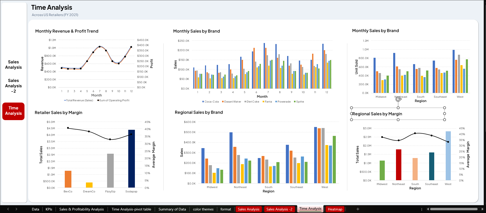
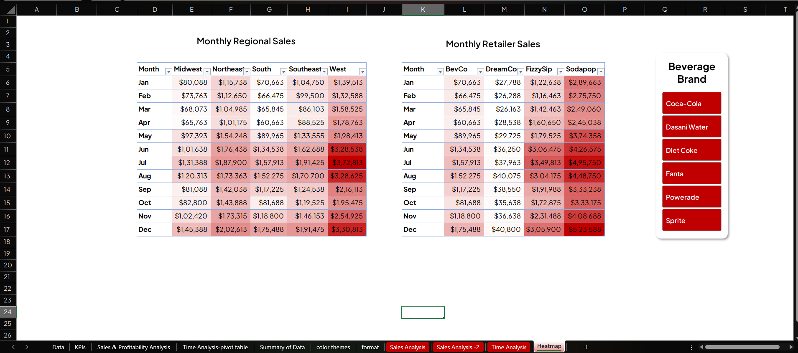

# 🥤 Coca-Cola Sales Analysis (Excel Dashboard Project)
## Excel-Based Business Intelligence Dashboard | FY 2021 | US Retailers

## 📌 Project Overview

This project analyzes Coca-Cola sales performance across major U.S. retailers using Microsoft Excel. The goal is to uncover actionable insights related to **sales trends, profitability, regional performance, and pricing strategy**.

### 🎯 Key Business Questions

- How do sales vary across regions and retailers?
- What is the relationship between price, volume, and profit?
- Which areas are driving or hurting profitability?
- How can Coca-Cola optimize sales strategy?

---

## 📊 Dataset Description

The dataset contains multi-sheet transactional data including:

- 💰 Revenue (Sales)
- 📦 Units Sold
- 📈 Operating Profit
- 💲 Price per Unit
- 🏪 Retailers: BevCo, DreamCo, FizzySip, Sodapop
- 🌍 Regions: Midwest, Northeast, South, Southeast, West
- 📅 Monthly Data: January – December

---

## 🧹 Data Preparation

The following data cleaning and transformation steps were performed:

- ✅ Cleaned column names and removed inconsistencies
- 🔄 Converted date and numeric formats
- ❌ Handled missing/null values
- 📊 Structured pivot tables for dashboard creation

---

## 📈 Dashboards Overview

### 1️⃣ Sales Analysis Dashboard

- Revenue & Profit overview
- Profit by Region and Retailer
- Scatter plots (Revenue vs Profit)
- Price vs Units Sold analysis

**Revenue & Profit Overview**
The business generated **$8.7M in total revenue** and **$3.2M in operating profit** 
across 17.1 million units sold at an average price of $0.49 per unit. The overall 
profit margin sits at approximately 37%, indicating a healthy but unevenly distributed 
business across regions and retailers.

**Profit by Region**
The West region leads all five regions with **$923K in total profit**, followed by 
Southeast ($641K), Northeast ($629K), South ($542K), and Midwest ($437K). However, 
West's dominance is driven by **transaction volume, not efficiency** — it actually 
has the lowest profit margin of all regions at just **32.6%**. In contrast, the 
South region, despite ranking 4th in total profit, operates at the highest margin 
of **42%**, making it the most efficient region in the portfolio.

**Profit by Retailer**
Sodapop is the standout performer with **$1.6M in profit** — nearly double its 
closest competitor FizzySip at $835K. BevCo contributes $542K, while DreamCo 
significantly underperforms at just **$147K** — trailing every other retailer by 
a wide margin across all twelve months of the year. This gap signals a structural 
issue with the DreamCo partnership that requires urgent attention.

**Top & Under-Performing Cities**
Birmingham leads all cities with a **50% operating margin**, followed by Knoxville 
(45%) and Richmond (42%). At the other end, Anchorage (25%) and Seattle (26%) 
consistently show the weakest margins — suggesting that pricing strategy, 
distribution costs, or competitive dynamics in these markets need to be reviewed.

**Scatter Plot — Revenue vs Profit**
All regions show a strong linear relationship between revenue and profit, confirming 
that margins are being maintained proportionally as revenue scales. Sodapop 
consistently occupies the top-right quadrant — high revenue AND high profit — 
while DreamCo compresses in the bottom-left on every chart.

**Price Elasticity — Price vs Units Sold**
A clear inverse relationship exists between price and volume. Units sold are highest 
in the **$0.20–$0.50 price range** and fall sharply above **$0.60 per unit**. 
Above $0.80, volume collapses to near zero. This defines Coca-Cola's optimal 
pricing corridor and means any price increase beyond $0.60 risks losing more 
revenue from volume loss than it gains from the higher price point.

👉 **Bottom Line:** West wins on scale, South wins on efficiency, Sodapop is 
the engine of profitability, and pricing discipline below $0.60 is non-negotiable 
to protect volume.

---

### 2️⃣ Sales Analysis – Volume Focus

- Bubble charts (Revenue vs Profit vs Volume)
- Retailer and region performance comparison
- Combo bar and line charts

#### 🔍 Key Findings

**Volume-Weighted Region Performance**
When units sold is added as a third dimension via bubble size, the West region's 
dominance becomes even clearer — it carries **4.6M units sold**, the largest bubble 
of any region, while also leading on revenue and profit. The Midwest, despite having 
the same number of transactions as West (936), has a dramatically smaller bubble — 
confirming that its underperformance is rooted in **low deal size, not low activity**.

**Volume-Weighted Retailer Performance**
Sodapop's bubble at **9.2M units** dwarfs every other retailer — it leads on all 
three dimensions simultaneously: highest revenue ($4.9M+), highest profit ($1.6M), 
and highest volume. DreamCo's bubble is the smallest of all retailers at just 820K 
units — confirming its weakness is systemic across pricing, volume, and margin, 
not limited to any single metric.

**Efficiency vs Scale — The BevCo Story**
The combo charts reveal something the total profit numbers hide: **BevCo is more 
efficient than its size suggests**. Its profit line sits proportionally higher 
relative to its revenue bar compared to FizzySip. This means BevCo has better 
cost management or pricing discipline per transaction — a model that could be 
scaled to improve overall portfolio efficiency.

**Southeast — Most Valuable Per Deal**
Southeast has the highest average revenue per transaction at **$3,212** and the 
highest average profit per transaction at **$1,272** — beating even the West on 
deal quality. With only 504 transactions (the fewest of all regions), its total 
is capped. Increasing distribution coverage and transaction frequency in the 
Southeast represents one of the highest-ROI opportunities in this dataset.

👉 **Bottom Line:** Volume explains why West leads the bar chart, but Southeast 
and BevCo show that deal quality matters just as much as deal count — and both 
are being underutilized.

---

### 3️⃣ Time Analysis Dashboard

- Monthly revenue and profit trends
- Seasonal sales patterns
- Brand-wise and region-wise sales performance
- Retailer sales by margin

#### 🔍 Key Findings

**Monthly Revenue & Profit Trend**
Both revenue and profit follow a clear seasonal curve throughout 2021. Performance 
dips in Q1 (January–March), recovers strongly through Q2, and **peaks in June and 
July** — the summer demand window. A mid-year softening occurs in August–September 
before a secondary recovery into November and December, likely driven by year-end 
promotional activity. This pattern is consistent across all regions and retailers.

**Summer Seasonality is the Single Biggest Lever**
June and July represent the highest-performing months on both revenue and profit 
across the entire year. This summer spike is not limited to one brand or region — 
it affects every segment of the business simultaneously. Coca-Cola should 
**front-load Q2 inventory and marketing spend** to maximize this predictable 
demand window rather than reacting to it after the fact.

**Brand-Level Performance**
Coca-Cola Classic consistently leads monthly sales across all twelve months, with 
its strongest performance in June and July. Dasani Water maintains a **more stable, 
year-round baseline** — making it a reliable volume contributor even during the 
off-peak months. Sprite and Fanta show the most pronounced seasonal variation, 
spiking sharply in summer and falling off in winter — these brands benefit most 
from targeted seasonal promotions.

**Retailer Sales by Margin**
Sodapop leads on total annual sales volume but its margin remains consistently 
strong — meaning it is not discounting to achieve its volume. BevCo shows a 
**disproportionately high margin line relative to its total sales bar**, 
suggesting it operates with tighter cost control and better pricing discipline 
per transaction than larger retailers. DreamCo's bars remain flat and low every 
single month with no seasonal uplift — the only retailer that fails to benefit 
from the summer demand peak.

**Regional Trends Over Time**
The West and Northeast regions track closely with the national trend — strong in 
summer, softer in winter. The Midwest shows the flattest monthly curve of any 
region, with minimal seasonal variation and the lowest absolute values throughout — 
reinforcing that its weakness is structural, not seasonal.

👉 **Bottom Line:** Summer is the most important trading period in the year and 
Coca-Cola Classic is the engine that powers it. Any strategy that misses Q2 
preparedness is leaving peak-season revenue on the table.

---

### 4️⃣ Heatmap Dashboard

- Monthly regional sales pivot table with heatmap
- Monthly retailer sales pivot table with heatmap

#### 🔍 Key Findings

**Monthly Regional Heatmap**
The regional heatmap makes seasonal patterns immediately visible without reading 
a single number. The **West column is consistently the darkest** across all twelve 
months — confirming its year-round dominance. June through August show the deepest 
red shading across all five regions simultaneously, providing visual confirmation 
of the summer peak identified in the Time Analysis dashboard. The **Midwest column 
remains noticeably paler** than all other regions throughout the year — including 
in summer — signaling that the seasonality boost that lifts every other region 
has minimal impact in the Midwest.

**Monthly Retailer Heatmap**
Sodapop's column is uniformly the darkest shade in every single month — from 
January through December — with no exceptions. Its December figure of **$5.23M** 
is the highest single-month retailer value in the entire dataset. DreamCo's column 
is consistently the palest, never coming close to the other retailers even during 
the peak summer months. Its highest month ($40.8K in December) is lower than 
BevCo's weakest month — making its underperformance impossible to attribute to 
seasonality or timing.

**What the Heatmap Reveals That Charts Cannot**
The side-by-side pivot layout makes it possible to compare all retailers and all 
regions in a single glance, without toggling between charts. This format is 
particularly effective for identifying **outlier months** — periods where one 
retailer or region suddenly spikes or drops relative to its own trend. In FY 2021, 
no major outlier months were detected, confirming that performance across the 
business is driven by consistent structural factors, not one-off events.

**Interactive Slicer Functionality**
Both tables are connected to the same slicer infrastructure, enabling dynamic 
filtering by month or region. Selecting a specific month updates all values 
simultaneously — allowing business users to interrogate any period without 
modifying the underlying data or breaking the dashboard structure.

👉 **Bottom Line:** The heatmap is the fastest way to answer the question 
*"where is the business strong and where is it weak?"* — Sodapop and West 
dominate in dark red, DreamCo and Midwest stay persistently pale, and summer 
months light up the entire grid.

---

## 🔍 Key Findings

| Area | Finding |
|---|---|
| **Top Retailer** | Sodapop — $1.6M profit, 9.2M units sold |
| **Top Region** | West — $923K profit, highest volume |
| **Weakest Retailer** | DreamCo — $147K profit, lowest across all metrics |
| **Weakest Region** | Midwest — $437K profit, lowest margin |
| **Peak Period** | June–July across all brands and regions |
| **Price Sweet Spot** | $0.40–$0.60 per unit (volume drops sharply above $0.60) |

---

## 💡 Business Recommendations

1. **Strengthen the Sodapop partnership** — expand shelf space, co-branded promotions, and preferential trade terms.
2. **Review DreamCo urgently** — diagnose whether the issue is pricing, distribution, or the partnership itself.
3. **Front-load Q2 investment** — capitalize on the June–July summer demand spike with increased inventory and marketing spend.
4. **Build a Midwest turnaround strategy** — targeted pricing adjustments and local brand activation campaigns.
5. **Protect the $0.40–$0.60 price band** — avoid price increases bove $0.60 to prevent significant volume erosion.

---

## 🛠 Tools Used

- Microsoft Excel
- Pivot Tables
- Slicers & Interactive Filters
- Data Visualization (Charts & Heatmaps)

---

## 🎯 Conclusion

This analysis demonstrates how Coca-Cola can improve profitability by balancing **pricing strategy, regional focus, and retailer performance**, while leveraging **seasonal demand patterns**.
